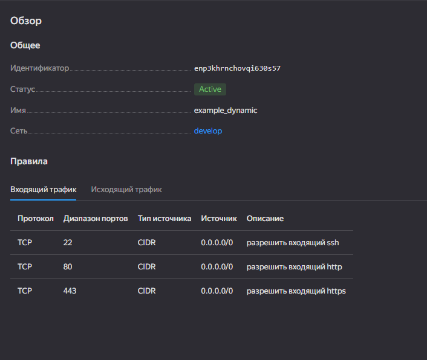
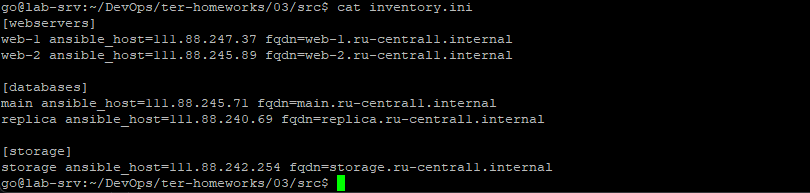
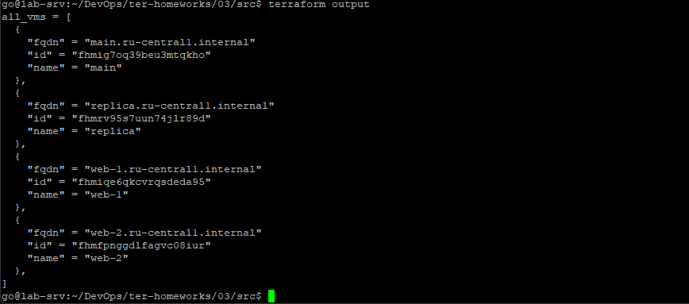

# Домашнее задание к занятию «Управляющие конструкции в коде Terraform»

### Задание 1

### Задание 2
- [count-vm.tf](src/count-vm.tf)
- [for_each-vm.tf](src/for_each-vm.tf)
- [locals.tf](src/locals.tf)
- [data-source.tf](src/data-source.tf)

### Задание 3
- [disk_vm.tf](src/disk_vm.tf)
  
### Задание 4

- [ansible.tf](src/ansible.tf)

### Задание 5*

- [output.tf](src/outputs.tf)
